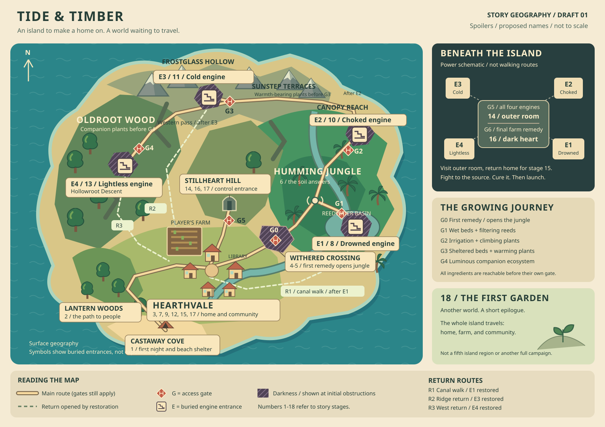

# Tide and Timber: Island Map

Status: proposed world layout for the [working story outline](story-outline.md).
Place names, connections, and environmental details are working suggestions.
The agreed sections of [Game Vision](game-vision.md) remain authoritative.



[Open the full-size map](island-map.svg).

This is a spoiler-filled design map, not the map shown to a new player. It is
schematic, not a tile layout or a commitment to island size or walking times.
Engine symbols mark surface entrances; the engine rooms themselves are buried.
The separate interior diagram shows power connections, not walkable tunnels.

## Geographic idea

The island has a sheltered southern shore, a settled southern valley, a wet
eastern jungle, a high northern ridge, and an old western forest. Rocky coasts,
ravines, and steep interior slopes divide the expedition regions. The geography
looks natural until exposed structures and restored systems tell another story.

**Hearthvale village is the permanent home hub.** The player's house, expanding
farm, library, and village square are close together. Farm growth happens in
adjoining plots: wet beds beside the watercourse, trellises in the main garden,
sheltered beds against the hill, and shaded companion beds at the woodland edge.
Progression does not force the player to abandon one farm and rebuild elsewhere.

The expedition route initially curls east and then north around the island.
Later restoration opens returns to the village, so late-game travel does not
mean replaying the entire opening route. The control-room entrance is under
Stillheart Hill, close to home but inaccessible until all four engines run.

## Places and their purpose

| Place | Position | Story and gameplay role |
| --- | --- | --- |
| Castaway Cove | Southern shore | Arrival, salvage, and the first night's temporary shelter. A wooded headland hides the village from the beach. |
| Lantern Woods | Between the cove and village | The introductory walk, maintained paths, signs of people, and the first villager encounter. |
| Hearthvale | South-central valley | Home, farming, relationships, library research, interpretation of discoveries, and departure preparations. |
| Withered Crossing | East of the village | The first darkness obstruction and small restoration encounter; not a fifth engine dungeon. |
| Humming Jungle | East-central lowlands | The first newly opened region, vibration clues, exposed symbols, and routes toward the first two engines. |
| Reedwater Basin | Southeastern interior | Filtering-reed specimens and the drowned engine entrance; its restored conduit supplies the village irrigation channel. |
| Canopy Reach | Northeastern jungle | Climbing-plant specimens, dark haze, and the choked engine entrance. |
| Sunstep Terraces | Northern ridge approach | Reached after engine two; warmth-bearing plants survive here outside the cold engine gate. |
| Frostglass Hollow | North-central ridge | The cold engine chamber lies below an unnaturally chilled rock shelf. Records inside support the ark revelation. |
| Oldroot Wood | Western interior | Reached through a pass thawed by engine three. A surviving fringe contains both species needed for the fourth remedy. |
| Hollowroot Descent | Beneath Oldroot Wood | The entrance to the lightless engine, not an unlit surface biome that is empty of useful life. |
| Stillheart Hill | Immediately north of the village | An old stone terrace covers the sealed control-room entrance. Its proximity makes the late revelation reframe a familiar landscape. |
| First Garden | Another world, off this map | The epilogue location; not an island region or a fifth expedition biome. |

## All 18 story stages on the map

| Stage | Location and movement | What the geography contributes |
| --- | --- | --- |
| 1. The first night | Castaway Cove | A small, sheltered arrival area with enough salvage and food to establish temporary shelter. |
| 2. A path through the woods | Cove -> Lantern Woods -> Hearthvale | A legible woodland path leads past maintained landmarks to a villager and the settlement. |
| 3. A place to belong | Hearthvale house, farm, and square | The player moves from a beach camp to a permanent home in an existing community. |
| 4. The forest that will not grow | Hearthvale -> near side of Withered Crossing | A short expedition reaches the first dark creatures and blocked route. The initial remedy plant and clues are on the reachable side. |
| 5. The first remedy | Hearthvale farm -> Withered Crossing -> jungle | The player grows the remedy at home and permanently clears G0, opening the jungle. |
| 6. Something beneath the roots | Humming Jungle and Reedwater Basin fringe | Follow the hum to exposed symbols and the sealed first dungeon entrance; collect clues and a reachable reed specimen. |
| 7. Four places in the old records | Return to Hearthvale library | Interpret the jungle symbol and identify the four destinations without immediately revealing their purpose as engines. |
| 8. The drowned engine | Farm -> Reedwater Basin -> E1 | A farm-grown treatment opens G1. Clear the separate internal source, restart the engine, and restore the canal return. |
| 9. The island answers | Canal return -> Hearthvale | Arrive alongside visibly restored water; improve irrigation and see the community respond. |
| 10. The choked engine | Farm -> jungle -> Canopy Reach -> E2 | Obtain the climbing plant outside G2. Improved farming enables the treatment; engine restoration clears the high-ridge approach. |
| 11. The cold engine | Sunstep Terraces -> farm -> Frostglass Hollow -> E3 | Collect warmth-bearing plants before G3. Grow the remedy at home, restore the engine, and reopen the western pass and ridge return. |
| 12. A home made to travel | Ridge return -> Hearthvale library and square | The ark revelation happens with the community, not in isolation at the end of a dungeon. |
| 13. The lightless engine | Western pass -> Oldroot fringe -> farm -> Hollowroot Descent -> E4 | Both companion species are available before G4. Restore the fourth engine and open the west return and control-room seal. |
| 14. The control-room threshold | Hearthvale -> Stillheart Hill -> outer control room | G5 now opens. Discover the ark's call and final remedy instructions, then freely return home. |
| 15. The final harvest | Hearthvale farm and village | All farm development comes together; the community helps prepare without a forced timer. |
| 16. The heart of the darkness | Stillheart Hill -> outer room -> inner control room | Beyond G6, combat reaches the source and the final farm remedy vanquishes it. Full control follows the cure. |
| 17. Preparing to leave | Hearthvale, then Stillheart Hill control room | Resolve preparations in the village; explicitly initiate launch from the restored controls. The entire island travels. |
| 18. The first green | First Garden, another world | A short epilogue echoes the first planting. It lies outside the island's exploration map. |

## Access and farming gates

Gate labels on the illustration are design labels, not names villagers use.
Opening an entrance only clears that local obstruction: it does not cure the
separate darkness source inside an engine room. Each engine must be reached,
cleansed, and restarted before its restoration effect occurs.

| Gate | What is blocked | Preparation available before the gate | What changes |
| --- | --- | --- | --- |
| G0 | Withered Crossing -> jungle | A first remedy plant on the village side, village knowledge, and the initial farm | The jungle route stays clear. |
| G1 | Reedwater Basin -> drowned engine | Reed specimens beside the basin approach; wet beds can be made with existing water access, before powered irrigation | A reed-derived treatment clears the seep at the entrance. Curing E1 restores the canal and improved irrigation. |
| G2 | Canopy Reach -> choked engine | Climbing-plant specimens on the outer jungle trail; E1 irrigation and trellises at home | A filtering preparation clears the entrance haze. Curing E2 restores circulation and clears the mist-filled route onto Sunstep Terraces. |
| G3 | Frostglass Hollow -> cold engine | Warmth-bearing plants on Sunstep Terraces; sheltered beds and soil preparation at home | A warming treatment opens the frozen approach. Curing E3 thaws the western pass and ridge return. |
| G4 | Hollowroot Descent -> lightless engine | Luminous plants and companion groundcover on the reachable Oldroot fringe; farm ecosystem development | The combined remedy clears the descent. Curing E4 opens its surface return and completes the power needed for G5. |
| G5 | Stillheart Hill -> outer control room | All four engines cleansed and running | The sealed entrance opens. The outer room provides final-remedy knowledge and an unrestricted return to the village. |
| G6 | Outer control room -> final source | Final remedy prepared at home using already reachable plants and methods | The prepared remedy allows the final approach; combat still has to reach the source, and applying the cure grants full control. |

The main dependency chain is:

```text
Beach -> village -> first remedy -> jungle
  -> wet cultivation -> E1 -> irrigation
  -> trellis cultivation -> E2 -> northern terraces
  -> sheltered cultivation -> E3 -> western pass
  -> companion ecosystem -> E4
  -> all four engines running -> outer control room
  -> return home for final cultivation -> final source
  -> return to community -> deliberate launch -> off-world epilogue
```

Canopy Reach can be scouted after G0; treating G2 still needs the E1 farming
upgrade. Later farming ingredients never sit inside the dungeon they unlock.
Essential seeds and treatments must remain recoverable if a harvest or
expedition is lost.

## Returns, shortcuts, and boundaries

| Route | When it becomes usable | Why it does not skip a gate |
| --- | --- | --- |
| Opening path | From the opening | Cove, Lantern Woods, and Hearthvale connect without a farming gate. |
| Village-jungle trail | After G0 | The route remains clear; individual engine entrances retain their own gates. |
| R1: canal walk | After E1 is cured and restarted | Restoration drains and clears an old towpath, and the player opens its return-side wicket. Before that, neither direction bypasses G0 or G1. No boat is required. |
| Canopy-terrace pass | After E2 is cured and restarted | Restored circulation clears the impassable haze in a narrow ravine; climbing crops do not independently bypass this regional boundary. |
| R2: ridge return | After E3 is cured and restarted | Thawing reopens a switchback route to Hearthvale. It cannot be entered from below to skip the northern sequence beforehand. |
| Western pass | After E3 is cured and restarted | The same thaw exposes the connection from the ridge to the Oldroot fringe. It does not cure G4. |
| R3: west return | After E4 is cured and restarted | A restored access mechanism opens a covered stair between Oldroot and the village. It is a travel reward, not early access to the fourth region. |
| Village-control path | Surface approach available earlier; G5 remains sealed | The hill is close to home throughout the story. Familiarity with it does not grant entry to the control room. |

Every engine also permits retreat along the route used to enter. The shortcuts
are conveniences, not the only means of returning home. The fourth preparation
trip can use the western pass and the already-open R2; the player does not need
R3 before curing E4.

The drawing does not depict every cliff, stream, or tree as a collision boundary.
Detailed maps must make the intended boundaries convincing: the coast cannot
provide an unplanned walk around the dark crossing, and a shortcut drawn near
an unopened region must not accidentally enter it. Swimming, boats, climbing,
and fast travel are not established mechanics or assumed bypasses.

## Surface and interior

The engine entrances sit in four broad quarters of the island; their chambers
are embedded in its underlying structure. Do not draw a visible metallic ring
joining them on the early surface map. The player discovers the repeated
construction gradually through expeditions.

Stillheart's outer room is a reconnaissance space at stage 14, and its inner
room holds the final darkness at stage 16. Power lines in the diagram explain
why all four engines are required; they do not create dungeon-to-dungeon paths
or an early back entrance to the control room.

Engine and control-room interiors still need their own later layouts. This map
establishes their placement, access rules, and story purpose, not room counts,
combat arenas, or puzzle solutions.

## Design choices to review

- The primarily east-to-north-to-west route versus a more freely ordered middle.
- The working place names and the proximity of the control entrance to home.
- The three restoration-opened return routes and their physical mechanisms.
- How large each region feels in play; this concept does not set travel times.
- How much of the surface map the player sees before exploring it. The complete
  design map must not become an early-game spoiler.
